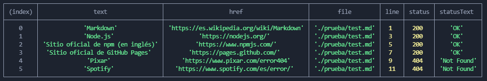
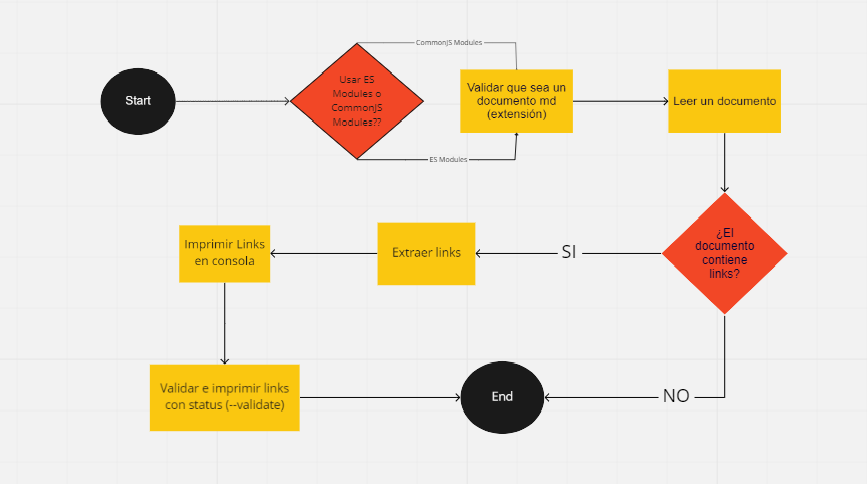

# Markdown Links

## mrg-md-Links
Es una librería que esta desarrollada para leer documentos con extensión '.md' y nos permite validar URL o links entregándonos información y sus estados, ejemplo(404, Not Found). 

### Instalación
```sh
npm i mrg-md-links
```

### Guía de uso

#### En la Terminal
Instalada la librería deberas escribir en la terminal, el comando junto al archivo.

`mrg-md-links <archivo.md> [option]`

#### Opciones
Al ejecutar la opción --validate, nos entregará los status de cada links. 
Ejemplo; 200, ok / 404, fail.

`[--validate] `

#### Visualización en la terminal
Al utilizar la librería deberia mostrarse de la siguiente manera:



### Planificación

 * Diagrama de Flujo en Miro. 




* GitHub Proyects utilizando issues y milestones. 

[Md-links Proyect](https://github.com/MacarenaRivera/SCL018-md-links/projects/1)

### Creadora

* Macarena Rivera
